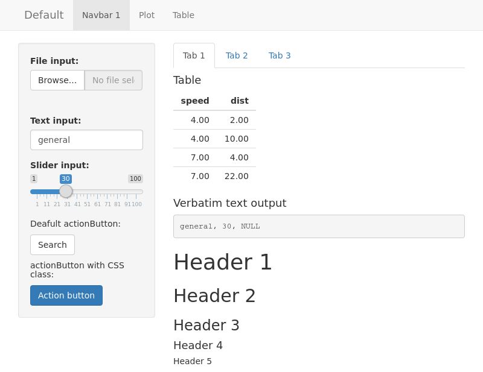
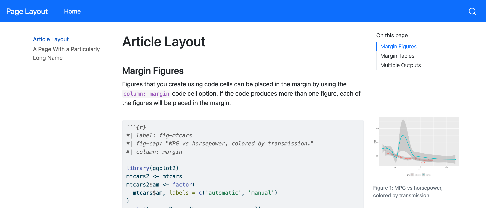
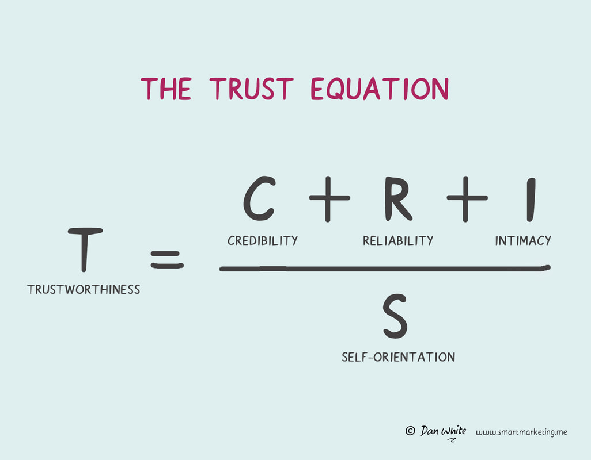
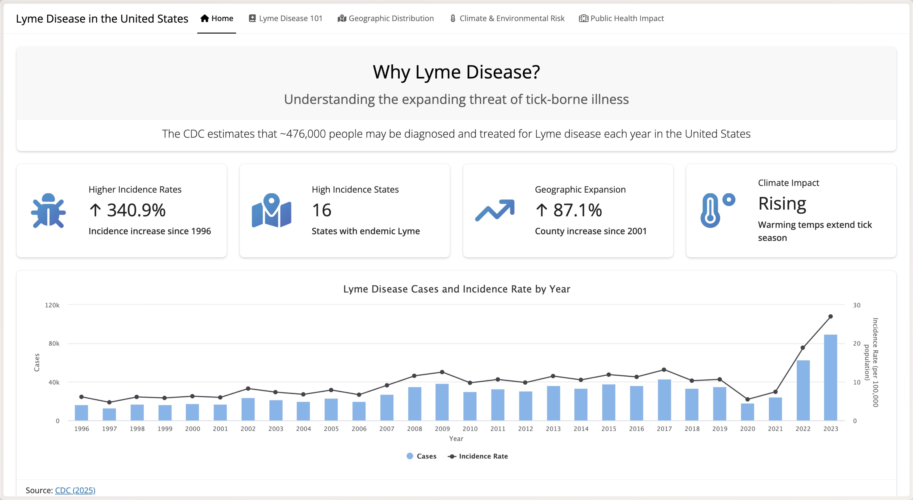
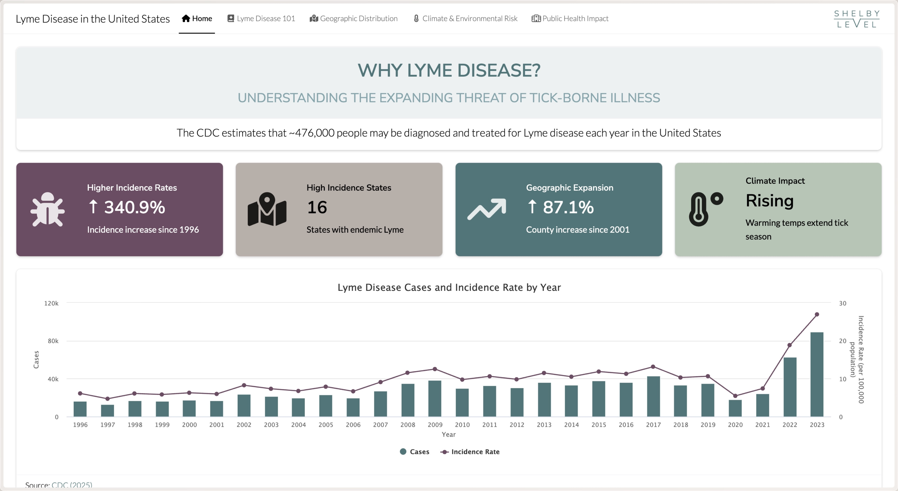

::: {.fragment}
{.absolute top=5px right=0 height="100%"}
:::

::: notes
To start us off I have a quick question: how many of you would download and install software from this website? Not many, right?
:::

---

::: {.fragment}
{.absolute top=5px right=0 height="100%"}
:::

::: notes
And how many of you would want to share this dashboard with your boss or a client? Again, not many. You might even be cringing at the thought of it.
:::

---

::: {.fragment}
{.absolute top=6px right=100px height="100%"}
:::

::: notes
Now your work probably doesn't look nearly as bad as the examples I just showed you. That is thanks to Bootstrap. Bootstrap is the default core styling and layout engine for HTML-based outputs, dashboards, websites, and books. When we make something with Quarto or Shiny, we are using Bootstrap often without knowing it.
This is what gives us our "good enough" look right out of the box. Your headers are bolded, your tables are formatted, and your content automatically resizes to fit the screen without having to write any CSS.
:::

---

::: {.columns}

::: {.column}
{.absolute top=5px right=400px height="100%"}
:::

::: {.column}
{.absolute top=120px left=465px height="60%"}
:::

:::

::: notes
But it also means that your work looks like every other dashboard or report you'v ever seen, and probably also the demo you copied from the Shiny or Quarto website. 
This default look has a cost. It feels unfinished, and it makes great data products much easier to ignore.
:::

---

::: notes
Hi everyone! I'm Shelby Level, and I work primarily on dashboards, reports, and other data products that help people make decisions.
Today's talk is about something that often gets treated as optional or an afterthought: styling.
Not because I think every data person should become a designer.
But because styling can make or break whether people engage with our work.
:::

---

## What to Expect

::: {.fragment}
1.  Why Styling Matters
:::
::: {.fragment}
2.  Color
:::
::: {.fragment}
3.  Leveraging Color with bootswatch
    -  bootswatch
    -  flip between themes with paper of different colors
:::
::: {.fragment}
4.  Typography
:::
::: {.fragment}
5.  Leveraging Typography with brand.yml
    -  brand.yml
    -  flip between fonts with paper of different fonts
:::
::: {.fragment}
6.  Creating Reliability
    -  brand.yml use across various formats
:::

::: notes
What to expect: In this talk we'll cover the basics of styling, why it matters, and discuss two important but easy to implement aspects of styling: color and typography. Finally, in this talk I’ll walk you through applying these skills to your own work, without a CSS induced headache
:::

---

## Why Styling Matters

::: notes
Why didn't you want to download software from that first website? Why didn't you want to share that dashboard with your boss or a client? Because you didn't trust it. It didn't matter what the contents were, the visual design was poor and you were instantly skeptical. Now you may not be able to put your finger on why, but researchers actually studied this. In a 2025 qualitative study they asked viewers what makes them trust a chart and coded their 185 responses into five real categories. This study found that people's own reasons for trusting (or distrusting) a chart go well beyond the data itself — and they don't always agree on which factors matter most.

Trust is an emotional gatekeeper, and it is influenced by more than just the data itself. The McKinley et al. (2025) framework proves that viewers reject accurate data if it fails the "instinct" test. People evaluate trustworthiness, usability, and professionalism almost instantly. The visual experience becomes part of the analytical experience.
:::

## Influencing Trust {auto-animate=true}

::: {#theme-container .trust-grid}

::: {.trust-column}
::: {#theme-readability .trust-box .trust-readability-bg data-id="readability-box"}
[Readability]{.trust-title}
:::

::: {.trust-chips .trust-readability-chips}
[Simple]{.trust-chip}
[Clarity]{.trust-chip}
[Complex]{.trust-chip}
:::
:::

::: {.trust-column}
::: {#theme-integrity .trust-box .trust-integrity-bg data-id="integrity-box"}
[Integrity & Transparency]{.trust-title}
:::

::: {.trust-chips .trust-integrity-chips}
[Data Integrity]{.trust-chip}
[Labeling]{.trust-chip}
[Source]{.trust-chip}
[Objectivity]{.trust-chip}
[Intent]{.trust-chip}
:::
:::

::: {.trust-column}
::: {#theme-quality .trust-box .trust-quality-bg data-id="quality-box"}
[Quality & Design]{.trust-title}
:::

::: {.trust-chips .trust-quality-chips}
[Vis Type]{.trust-chip}
[Visual Elements]{.trust-chip}
[Aesthetics]{.trust-chip}
[Professional]{.trust-chip}
[Academic]{.trust-chip}
:::
:::

::: {.trust-column}
::: {#theme-familiarity .trust-box .trust-familiarity-bg data-id="familiarity-box"}
[Familiarity]{.trust-title}
:::

::: {.trust-chips .trust-familiarity-chips}
[With Topic]{.trust-chip}
[With Source]{.trust-chip}
[Unspecified]{.trust-chip}
:::
:::

::: {.trust-column}
::: {#theme-personal .trust-box .trust-personal-bg data-id="personal-box"}
[Personal]{.trust-title}
:::

::: {.trust-chips .trust-personal-chips}
[Confidence]{.trust-chip}
[Intuition]{.trust-chip}
[Relevance]{.trust-chip}
[Reliability]{.trust-chip}
[Importance]{.trust-chip}
:::
:::

:::

::: notes
Here are all the design factors that influence a viewer's perceived trustworthiness of your work. That's a lot right? Let's break it down
:::

## Cognition-Based Components {auto-animate=true}

::: {#theme-container .trust-zoom-grid}

::: {.trust-zoom-focus}

::: {.trust-column}
::: {#theme-readability .trust-box .trust-readability-bg data-id="readability-box"}
[Readability]{.trust-title}
:::

::: {.trust-chips .trust-readability-chips}
[Simple]{.trust-chip}
[Clarity]{.trust-chip}
[Complex]{.trust-chip}
:::
:::

::: {.trust-column}
::: {#theme-integrity .trust-box .trust-integrity-bg data-id="integrity-box"}
[Integrity & Transparency]{.trust-title}
:::

::: {.trust-chips .trust-integrity-chips}
[Data Integrity]{.trust-chip}
[Labeling]{.trust-chip}
[Source]{.trust-chip}
[Objectivity]{.trust-chip}
[Intent]{.trust-chip}
:::
:::

:::

::: {.trust-zoom-sidebar}
::: {#theme-quality .trust-box .trust-quality-bg data-id="quality-box"}
[Quality & Design]{.trust-title}
:::
::: {#theme-familiarity .trust-box .trust-familiarity-bg data-id="familiarity-box"}
[Familiarity]{.trust-title}
:::
::: {#theme-personal .trust-box .trust-personal-bg data-id="personal-box"}
[Personal]{.trust-title}
:::
:::

:::

::: notes
Here is where we spend the most time on: Readability and Integrity & Transparency. We make sure the data is accurate, the source is credible, and the intent is clear. 

* **Data Accuracy:** Clean data, clear labeling.
* **Source & Intent:** Citation, peer review, objectivity.
* *Status: Crucial, non-negotiable, and where we spend our time.*
:::

## Affective-Based Components {auto-animate=true}

::: {#theme-container .trust-zoom-grid}

::: {.trust-zoom-sidebar}
::: {#theme-readability .trust-box .trust-readability-bg data-id="readability-box"}
[Readability]{.trust-title}
:::
::: {#theme-integrity .trust-box .trust-integrity-bg data-id="integrity-box"}
[Integrity & Transparency]{.trust-title}
:::
:::

::: {.trust-zoom-focus .trust-zoom-focus-3col}

::: {.trust-column}
::: {#theme-quality .trust-box .trust-quality-bg data-id="quality-box"}
[Quality & Design]{.trust-title}
:::

::: {.trust-chips .trust-quality-chips}
[Vis Type]{.trust-chip}
[Visual Elements]{.trust-chip data-id="chip-visual-elements"}
[Aesthetics]{.trust-chip data-id="chip-aesthetics"}
[Professional]{.trust-chip data-id="chip-professional"}
[Academic]{.trust-chip}
:::
:::

::: {.trust-column}
::: {#theme-familiarity .trust-box .trust-familiarity-bg data-id="familiarity-box"}
[Familiarity]{.trust-title}
:::

::: {.trust-chips .trust-familiarity-chips}
[With Topic]{.trust-chip}
[With Source]{.trust-chip data-id="chip-with-source"}
[Unspecified]{.trust-chip}
:::
:::

::: {.trust-column}
::: {#theme-personal .trust-box .trust-personal-bg data-id="personal-box"}
[Personal]{.trust-title}
:::

::: {.trust-chips .trust-personal-chips}
[Confidence]{.trust-chip}
[Intuition]{.trust-chip data-id="chip-intuition"}
[Relevance]{.trust-chip}
[Reliability]{.trust-chip data-id="chip-reliability"}
[Importance]{.trust-chip}
:::
:::

:::

:::

::: notes
But we often overlook the other three dimensions: Quality & Design, Familiarity, and Personal Intuition, dismissing them as "superficial styling." However, these are the emotional and cognitive gatekeepers that can make or break whether someone trusts our work.

* Execution & Aesthetics
* Psychological Alignment
* *Status: Often dismissed as "superficial styling."*
:::

## Where This Talk Is Headed {auto-animate=true}

::: {#theme-container .trust-zoom-grid}

::: {.trust-zoom-sidebar}
::: {#theme-readability .trust-box .trust-readability-bg data-id="readability-box"}
[Readability]{.trust-title}
:::
::: {#theme-integrity .trust-box .trust-integrity-bg data-id="integrity-box"}
[Integrity & Transparency]{.trust-title}
:::
:::

::: {.trust-zoom-focus .trust-zoom-focus-3col}

::: {.trust-column}
::: {#theme-quality .trust-box .trust-quality-bg data-id="quality-box"}
[Quality & Design]{.trust-title}
:::

::: {.trust-chips .trust-quality-chips}
[Vis Type]{.trust-chip}
[Visual Elements]{.trust-chip .trust-chip-focus data-id="chip-visual-elements"}
[Aesthetics]{.trust-chip .trust-chip-focus data-id="chip-aesthetics"}
[Professional]{.trust-chip .trust-chip-focus data-id="chip-professional"}
[Academic]{.trust-chip}
:::
:::

::: {.trust-column}
::: {#theme-familiarity .trust-box .trust-familiarity-bg data-id="familiarity-box"}
[Familiarity]{.trust-title}
:::

::: {.trust-chips .trust-familiarity-chips}
[With Topic]{.trust-chip}
[With Source]{.trust-chip .trust-chip-focus data-id="chip-with-source"}
[Unspecified]{.trust-chip}
:::
:::

::: {.trust-column}
::: {#theme-personal .trust-box .trust-personal-bg data-id="personal-box"}
[Personal]{.trust-title}
:::

::: {.trust-chips .trust-personal-chips}
[Confidence]{.trust-chip}
[Intuition]{.trust-chip .trust-chip-focus data-id="chip-intuition"}
[Relevance]{.trust-chip}
[Reliability]{.trust-chip .trust-chip-focus data-id="chip-reliability"}
[Importance]{.trust-chip}
:::
:::

:::

:::

::: notes
These six factors — the design, source, and intuition cues — are what the rest of this talk will focus on.
:::

## Revisit

::: {.fragment}
{.absolute top=5px right=0 height="100%"}
:::

::: notes
Still not convinced that these affective-based components are worth your time? Let's revisit the first example. Most of you labelled the website I showed you as untrustworthy. Why? Because it failed the "instinct" test. It didn't look professional, the source didn't look familiar, and it didn't inspire confidence. However, there are probably a few of you who would download software from this website because you recognize it as a trusted source. DistroWatch has been a credible and reliable source of information for the Linux Community, one of the most widely used operating system in the world, for over 25 years? Linux users have trusted this site for decades to track, compare, and learn about different available Linux distributions. 

Now that you know the cognitive based components check out, you're probably more likely to overlook the affective based components when reconsidering your initial assessment. This demonstrates the interplay between the cognitive and affective components of trust. The data is the same, but the perceived quality changes dramatically based on the design, source, and intuition cues you receive on first glance.
:::

## Trust is an Emotional Gatekeeper for Our Work

::: notes
Tying this back to our work: A data professional would probably trust your work even if it wasn't well designed, so long as the cognitive based components are sound like your sources, data integrity, and objectivity. However, the intended audience of our work is usually not data professionals. They are busy decision makers. They don't have time to read every chart, and they don't have time to evaluate the quality of our work. They make snap judgments based on their first impressions, meaning they might not even get to considering your data sources and integrity if their intuition tells them it's untrustworthy. And those first impressions are influenced by the design, source, and intuition cues we just discussed. This is why styling matters, and why it is worth your time to learn how to do it well.
:::

## Trust is an Emotional Gatekeeper {auto-animate=true}

::: notes
But we often overlook the other three dimensions: Quality & Design, Familiarity, and Personal Intuition, dismissing them as "superficial styling." However, these are the emotional and cognitive gatekeepers that can make or break whether someone trusts our work.

* Execution & Aesthetics
* Psychological Alignment
* *Status: Often dismissed as "superficial styling."*

* **Aesthetics**
* **Visual Elements**
* **Professional Finish**

* **With Source**
* Reduces cognitive load
* Visual recognition
:::

## ...But Trust is an Emotional Gatekeeper {auto-animate=true}

::: {.intro-text .short}
McKinley, Pandey & Ottley's 2025 CHI study on viewer trust in data visualization found that people's own reasons for trusting (or distrusting) a chart go well beyond the data itself — and they don't always agree on which factors matter most:
:::

::: {#framework-grid data-id="framework-grid" .focus-grid-expanded}

::: {#box-rational data-id="box-rational" .box-rational-faded}
### 1. Integrity & Transparency

* Data Accuracy
* Source & Intent
:::

::: {#box-emotional data-id="box-emotional" .box-emotional-active}
### The Design & Psychological Triad

::: {.triad-grid}

::: {.fragment .fragment-card .fragment-quality}
#### 🎨 Quality & Design

* [Aesthetics]{.trust-focus-item}
* [Visual Elements]{.trust-focus-item}
* [Professional Finish]{.trust-focus-item}
:::

::: {.fragment .fragment-card .fragment-familiarity}
#### 🤝 Familiarity

* [With Source]{.trust-focus-item}
* Reduces cognitive load
* Visual recognition
:::

::: {.fragment .fragment-card .fragment-personal}
#### 🧠 Personal Context

* Confidence
* [Reliability]{.trust-focus-item}
* [Intuition]{.trust-focus-item}
:::

:::
:::
:::

## The Takeaway: Design Earns the Right to be Read

::: {.takeaway-wrap}

::: {.takeaway-quote}
"Data integrity builds the truth, but quality and design build the *bridge* to that truth."
:::

::: {.takeaway-list}
* **Without Quality:** Excellent data is dismissed as amateurish or suspicious.
* **Without Familiarity:** Complex data induces anxiety and cognitive rejection.
* **Without Personal Intuition:** The user lacks the raw confidence to act on your insights.
:::

:::

::: notes
The "Hard" Metrics (The Baseline): Data Integrity, Source, and Intent are what data professionals focus 99% of their time on. They are required, but they are invisible if the user rejects the chart upfront.

The "Soft" Metrics (The Gatekeepers): Quality, Familiarity, and Personal Intuition act as the emotional and cognitive gatekeeper. If a chart looks unprofessional or unfamiliar, viewers experience friction and judge it as untrustworthy before they even read a single data point.
:::

---

## Hidden Dimensions of Visual Trust


---

## Trust Equation

{.absolute top=0px right=0 height="100%"}

___

## Styling != Trust

Linux reveal

---

::: {.fragment}
{fig-align="center"}
:::

::: notes
I’ll let you in on a secret, this is my dashboard and over time I’ve learned how to style data products people actually want to use, like this one
:::

---

::: {.fragment}
{fig-align="center"}
:::

---

## Why Styling Matters

Trust

-  Color
-  Typography

::: notes
When creating data products, the visual design plays a crucial role in how users interact with and perceive the information. A well-designed interface can make complex data more accessible and engaging, while a poorly designed one can lead to confusion and disengagement.

People evaluate trustworthiness, usability, and professionalism almost instantly.

The visual experience becomes part of the analytical experience.

That may not feel fair, but it's reality.
:::

---

## The Landscape of Visual Trust {auto-animate=true}

::: {style="text-align: center; margin-top: 10px; font-size: 1.1em; color: #bbb;"}
Perceived trustworthiness is driven by 5 core macro themes and 16 distinct design keywords.
:::

::: {#big-picture-grid style="display: grid; grid-template-columns: repeat(5, 1fr); gap: 15px; margin-top: 30px; height: 680px;"}

<!-- 1. READABILITY (BLUE) -->
::: {#theme-readability style="background: #162a3d; border-top: 6px solid #2b5c8f; padding: 20px; border-radius: 8px; display: flex; flex-direction: column; gap: 12px;"}
### 📱 Readability
::: {.keyword style="background: #2b5c8f;"} Simple :::
::: {.keyword style="background: #2b5c8f;"} Complex :::
::: {.keyword style="background: #2b5c8f;"} Clarity :::
:::

<!-- 2. INTEGRITY & TRANSPARENCY (GREEN) -->
::: {#theme-integrity style="background: #132b1a; border-top: 6px solid #2e6f40; padding: 20px; border-radius: 8px; display: flex; flex-direction: column; gap: 12px;"}
### 🛡️ Integrity
::: {.keyword style="background: #2e6f40;"} Data Integrity
  <span class="sub-pill">↳ Labeling</span>
:::
::: {.keyword style="background: #2e6f40;"} Source
  <span class="sub-pill">↳ Objectivity</span>
:::
::: {.keyword style="background: #2e6f40;"} Intent :::
:::

<!-- 3. QUALITY & DESIGN (ORANGE) -->
::: {#theme-quality style="background: #36200d; border-top: 6px solid #d97724; padding: 20px; border-radius: 8px; display: flex; flex-direction: column; gap: 12px;"}
### 🎨 Quality & Design
::: {.keyword style="background: #d97724;"} Vis Type
  <span class="sub-pill">↳ Visual Elements</span>
:::
::: {.keyword style="background: #d97724;"} Aesthetics
  <span class="sub-pill">↳ Professional</span>
:::
::: {.keyword style="background: #d97724;"} Academic :::
:::

<!-- 4. FAMILIARITY (PURPLE) -->
::: {#theme-familiarity style="background: #21152e; border-top: 6px solid #6a3d9a; padding: 20px; border-radius: 8px; display: flex; flex-direction: column; gap: 12px;"}
### 🤝 Familiarity
::: {.keyword style="background: #6a3d9a;"} with Topic :::
::: {.keyword style="background: #6a3d9a;"} with Source :::
::: {.keyword style="background: #6a3d9a;"} Unspecified :::
:::

<!-- 5. PERSONAL (GRAY) -->
::: {#theme-personal style="background: #262626; border-top: 6px solid #555555; padding: 20px; border-radius: 8px; display: flex; flex-direction: column; gap: 12px;"}
### 🧠 Personal
::: {.keyword style="background: #555555;"} Confidence
  <span class="sub-pill">↳ Reliability</span>
:::
::: {.keyword style="background: #555555;"} Intuition
  <span class="sub-pill">↳ Importance</span>
:::
::: {.keyword style="background: #555555;"} Relevance :::
:::

:::

## Design Factors That Influence Perceived Trustworthiness

::::::: {.hierarchy node-color="#dddddd" arrow-color="#999999"}
:::::: {.item color="#f2f2f2"}

::::: {.item color="#87cefa"}
Readability

:::: {.item color="#8FC1E8"}
Complex
::::

:::: {.item color="#8FC1E8"}
Simple
::::

:::: {.item color="#8FC1E8"}
Clarity
::::
:::::

::::: {.item color="#A9D18E"}
Integrity and Transparency

:::: {.item color="#A9D18E"}
Data Integrity

::: {.item color="#A9D18E"}
Labeling
:::
::::

:::: {.item color="#A9D18E"}
Source

::: {.item color="#A9D18E"}
Objectivity
:::
::::

::: {.item color="#A9D18E"}
Intent
:::
:::::

::::: {.item color="#E8974E"}
Quality & Design

:::: {.item color="#E8974E"}
Vis Type

::: {.item color="#E8974E"}
Visual Elements
:::
::::

:::: {.item color="#E8974E"}
Aesthetics

::: {.item color="#E8974E"}
Professional
:::
::::

::: {.item color="#E8974E"}
Academic
:::
:::::

::::: {.item color="#d8bfd7"}
Familiarity

:::: {.item color="#C6A2D9"}
with Topic
:::

:::: {.item color="#C6A2D9"}
with Source
::::

:::: {.item color="#C6A2D9"}
Unspecified
::::
:::::

::::: {.item color="#c7c7c7"}
Personal

:::: {.item color="#B0B0B0"}
Confidence

::: {.item color="#B0B0B0"}
Reliability
:::
::::

:::: {.item color="#B0B0B0"}
Intuition

::: {.item color="#B0B0B0"}
Importance
:::
::::

::: {.item color="#B0B0B0"}
Relevance
:::
:::::
::::::
:::::::

---

## Color

---

## Leveraging Color

:::: {.codewindow}
::: {.editor .qmd name="ui.R"}
```r
bslib::page_navbar(
  title = "Dashboard",
  bslib::nav_panel(...)
)
```
:::

::: {.editor .qmd .fragment name="ui.R"}
```{.r code-line-numbers="|3"}
bslib::page_navbar(
  title = "Dashboard",
  theme = bslib::bs_theme(preset = "lux"),
  bslib::nav_panel(...)
)
```
:::
::::

---

## Typography

---

## Using Typography

---

{.absolute top=0 right=200px height="100%"}

::: notes
Themes for bootstrap are available through Bootswatch, which is a collection of free and open-source themes that can be easily applied to your dashboards and reports. These themes provide a quick way to change the look and feel of your data products without having to write custom CSS.
:::

---

## Apply Bootswatch Theme

::::: {.codewindow}
::: {.editor .r name="ui.R"}
```{.r code-line-numbers="|6-9"}
bslib::page_navbar(
    title = "Dashboard",
    id = "main_nav",

    theme = bslib::bs_theme(
        preset = "lux",
        brand = "www/brand.yml"
    )
)
```
:::
:::::

---

::: {.codewindow .r}
my-deck.R
````{.r}
bslib::page_navbar(
    title = "Dashboard",
    id = "main_nav",

    theme = bslib::bs_theme(
        preset = "sandstone",
        brand = "www/brand.yml"
    )
)
````
:::

---

{.absolute top=0 right=0 height="100%"}

---

<!-- ::: {.codewindow .codewindow-dark .quarto width="80%"}
my-deck.qmd

````markdown
```{{r}}
#| echo: false
plot(1:10)
```
````
::: -->

---

:::: {.codewindow}
::: {.editor .yaml name="00-load.R"}
```yaml
meta:
  name: shelbylevel
  link: https://www.shelbylevel.org

color:
  palette:
    deep-jade: "#254D56"
    faded-jade: "#45767a"
    faded-jade-50: "#a2bbbd"
    faded-jade-30: "#c7d6d7"
    faded-jade-10: "#ecf1f2"
    gulfstream: "#7fa6ad"
    edgewater: "#d3dfdd"
    edgewater-20: "#dce5e4"
    cascade: "#b3c2c9"
    boulder: "#727E70"
    spring-rain: "#b2c5b4"
    timberwolf: "#D8D5CE"
    timberwolf-50: "#eceae7"
    almond-dust: "#B8AEA8"
    moonstone: "#969996"
    storm-cloud: "#64635E"
    plum-crazy: "#59224A"
  
  foreground: $brand-deep-jade       # main text color
  background: $brand-faded-jade-10     # background
  primary: "#45767a"            # primary brand color
  secondary: "#7fa6ad"          # secondary accent
  tertiary: "#a2bbbd"           # tertiary accent
  success: "#727E70"            # success states
  info: "#b2c5b4"               # info messages
  warning: "#B8AEA8"            # warnings
  danger: "#6f4a64"             # errors/danger
  light: "#ecf1f2"              # light backgrounds
  dark: "#64635E"               # dark elements
```
:::

::: {.editor .yaml .fragment name="01-clean.R"}
```yaml
typography:
  fonts:
    - family: "Lato"
      source: google
      weight: [200, 300, 400, 600]
    - family: "Nunito Sans"
      source: google
      weight: [400, 600]
  
  base:
    family: "Lato"
    size: "1rem"
    line-height: 1.6
    weight: 300
  
  headings:
    family: "Nunito Sans"
    style: normal
    weight: 600
    line-height: 1.2
    color: primary
```
:::
::::

---

## Summary {.bd-slide}

::: {.gd-stage-wrap}
<div id="bd-stage"></div>
:::
[]{.fragment .gd-frag id="bd-lay"}
[]{.fragment .gd-frag id="bd-explode"}
[]{.fragment .gd-frag id="bd-focus-base"}
[]{.fragment .gd-frag id="bd-focus-bootswatch"}
[]{.fragment .gd-frag id="bd-focus-brand"}
[]{.fragment .gd-frag id="bd-focus-polish"}
[]{.fragment .gd-frag id="bd-collapse"}
[]{.fragment .gd-frag id="bd-unrotate"}

::: notes

If you remember one thing from this talk, let it be this slide.
Bootswatch provides a polished foundation.
brand.yml provides reusable customization.
Together, they create a practical workflow.

:::
