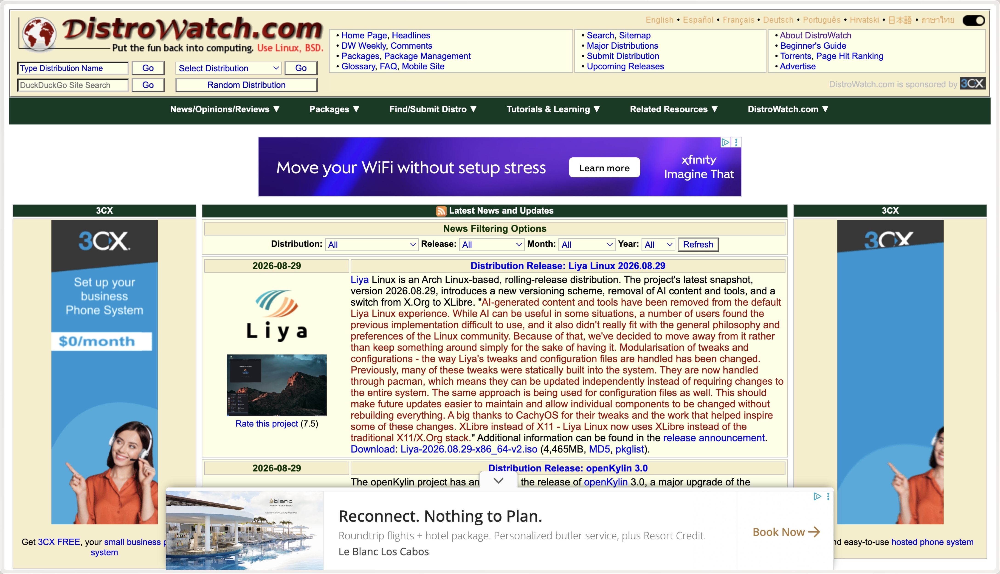
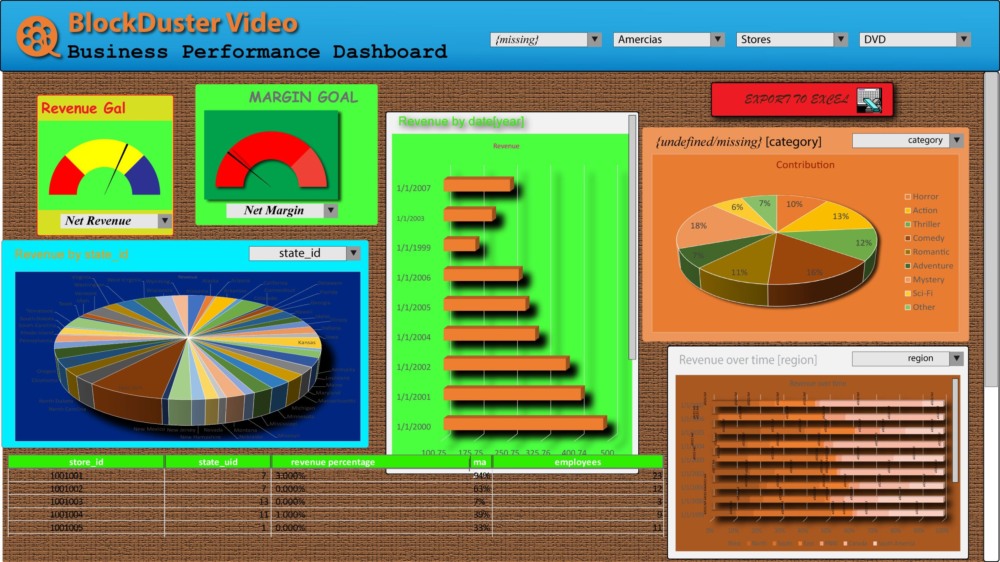
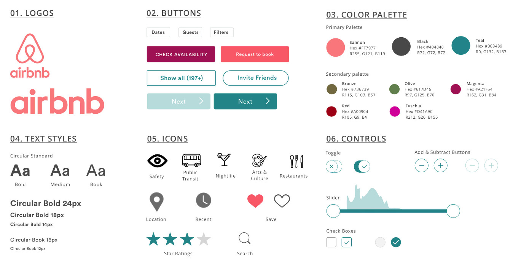
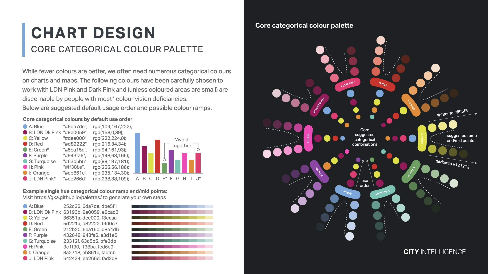
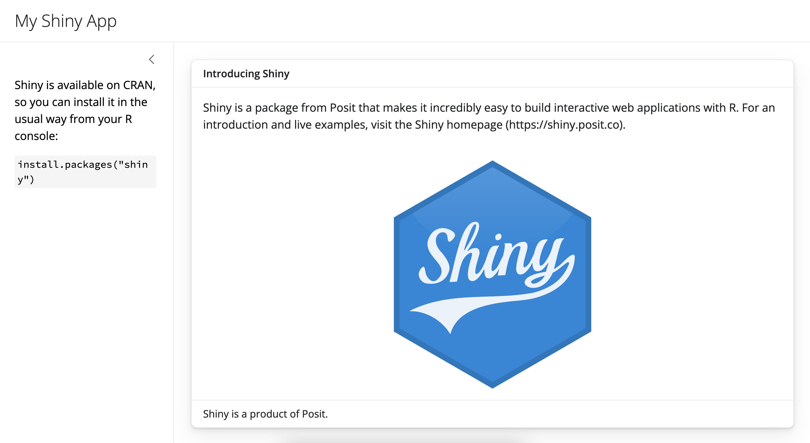
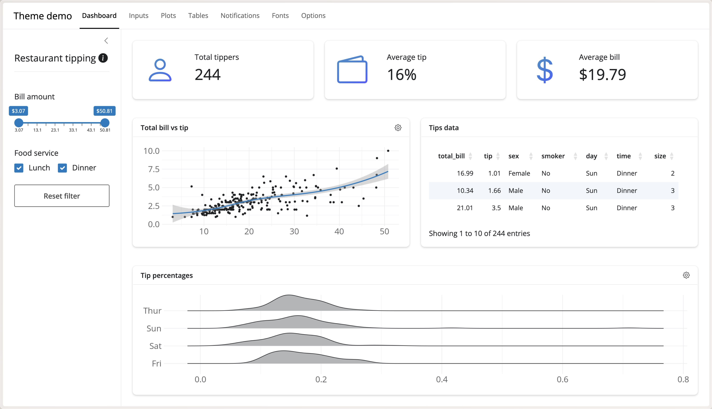

{.absolute height="100%"}

::: notes
I want to start us off with a quick question.

How many of you would download and install software you found on this website?

Not many, right?
:::

---

{.absolute top=10px height="100%"}

::: notes
Now, How many of you want to share this dashboard with your boss or a client?

Anyone? I would rather pretend I can't make dashboards at all.

These are two very different products, but they create the same reaction: hesitation.
:::

## You already made a judgment {.center}

::: {.fragment}
Before reading a single number
:::

::: notes
You already made a judgment, before reading a single number
You don't know if the software works or whether the dashboard data is accurate.

But you have already decided whether you want to keep looking.

That first impression doesn't tell you whether the product is actually trustworthy.

But it affects whether you give the product a chance to prove that it is.
:::

## Who I Am {.center}

::: notes
I’m Shelby Level. I build dashboards, reports, and other data products that help people make decisions. I came to this work as a data person, not as a designer.

And I have made some not so great looking dashboards and reports along the way.

I cared about if the numbers were right, the code ran, and the dashboard loaded. And then I was done. Or at least, I really wanted to be done and the last thing I wanted to do was fight with CSS.

I looked at the default Bootstrap theme applied to my work and thought, “It works, it's accessible and it looks fine. Surely that's enough.

Sometimes it is enough. But sometimes this "good enough" makes really good work much easier to ignore.
:::

## Styling is Not Evidence {.center}

::: {.fragment}
But it influences whether people examine the evidence
:::

::: notes
Styling is Not Evidence, But it influences whether people examine the evidence

Before we go further, I want to be clear: Polished styling does not make data accurate, just like a nice font can't replace credible sources.

But styling can affect whether someone pauses to pay attention and give our work a chance.

TODO: It can communicate that someone thought about the audience and that this is finished work, not something that accidentally escaped from our development environment.

Styling doesn't create the evidence, but it helps determine how the evidence is received.
:::

## People evaluate more than the data {.center}

::: notes
People evaluate more than the data
And this isn't something I made up to justify spending too much time playing with the Adobe Color Wheel tool.

In a 2025 study, researchers asked people to rank visualizations by perceived trustworthiness and explain their reasoning.

And, as expected, people talked about data accuracy, sources, and objectivity.
But they also mentioned aesthetics, professionalism, familiarity, and even intuition.

People were evaluating more than whether the numbers looked correct, they were evaluating the entire visual experience.
:::

## What Viewers Use to Judge Trust {auto-animate=true}

::: {#theme-container .trust-grid}

::: {.trust-column}
::: {#theme-readability .trust-box .trust-readability-bg data-id="readability-box" .fragment data-fragment-index="1"}
[Readability]{.trust-title}
:::

::: {.trust-chips .trust-readability-chips .fragment data-fragment-index="6"}
[Simple]{.trust-chip}
[Clarity]{.trust-chip}
[Complex]{.trust-chip}
:::
:::

::: {.trust-column}
::: {#theme-integrity .trust-box .trust-integrity-bg data-id="integrity-box" .fragment data-fragment-index="2"}
[Integrity & Transparency]{.trust-title}
:::

::: {.trust-chips .trust-integrity-chips .fragment data-fragment-index="6"}
[Data Integrity]{.trust-chip}
[Labeling]{.trust-chip}
[Source]{.trust-chip}
[Objectivity]{.trust-chip}
[Intent]{.trust-chip}
:::
:::

::: {.trust-column}
::: {#theme-quality .trust-box .trust-quality-bg data-id="quality-box" .fragment data-fragment-index="3"}
[Quality & Design]{.trust-title}
:::

::: {.trust-chips .trust-quality-chips .fragment data-fragment-index="6"}
[Vis Type]{.trust-chip}
[Visual Elements]{.trust-chip}
[Aesthetics]{.trust-chip}
[Professional]{.trust-chip}
[Academic]{.trust-chip}
:::
:::

::: {.trust-column}
::: {#theme-familiarity .trust-box .trust-familiarity-bg data-id="familiarity-box" .fragment data-fragment-index="4"}
[Familiarity]{.trust-title}
:::

::: {.trust-chips .trust-familiarity-chips .fragment data-fragment-index="6"}
[With Topic]{.trust-chip}
[With Source]{.trust-chip}
[Unspecified]{.trust-chip}
:::
:::

::: {.trust-column}
::: {#theme-personal .trust-box .trust-personal-bg data-id="personal-box" .fragment data-fragment-index="5"}
[Personal]{.trust-title}
:::

::: {.trust-chips .trust-personal-chips .fragment data-fragment-index="6"}
[Confidence]{.trust-chip}
[Intuition]{.trust-chip}
[Relevance]{.trust-chip}
[Reliability]{.trust-chip}
[Importance]{.trust-chip}
:::
:::

:::

::: notes
Their responses fell into five broad categories: readability, integrity and transparency, quality and design, familiarity, and personal factors.

People didn't always prioritize the same things. One person forcused on a clearly cited source while another focused on clarity.

And, unfortunately, the researchers didn't discover a magical checklist that will make every person trust everything you produce.

Here are all of the individual keywords that participants used to describe why they trusted a visualization. And this is a lot of information to process, and it can be overwhelming to think about how to address all of these factors in our work.

So let's take a step back and break it down into a more manageable framework. This reveals two broader ways we evaluate trust: cognitively and affectively.
:::

## Cognition-Based Components {auto-animate=true}

::: {#theme-container .trust-zoom-grid}

::: {.trust-zoom-focus}

::: {.trust-column}
::: {#theme-readability .trust-box .trust-readability-bg data-id="readability-box"}
[Readability]{.trust-title}
:::

::: {.trust-chips .trust-readability-chips}
[Simple]{.trust-chip}
[Clarity]{.trust-chip}
[Complex]{.trust-chip}
:::
:::

::: {.trust-column}
::: {#theme-integrity .trust-box .trust-integrity-bg data-id="integrity-box"}
[Integrity & Transparency]{.trust-title}
:::

::: {.trust-chips .trust-integrity-chips}
[Data Integrity]{.trust-chip}
[Labeling]{.trust-chip}
[Source]{.trust-chip}
[Objectivity]{.trust-chip}
[Intent]{.trust-chip}
:::
:::

:::

::: {.trust-zoom-sidebar}
::: {#theme-quality .trust-box .trust-quality-bg data-id="quality-box"}
[Quality & Design]{.trust-title}
:::
::: {#theme-familiarity .trust-box .trust-familiarity-bg data-id="familiarity-box"}
[Familiarity]{.trust-title}
:::
::: {#theme-personal .trust-box .trust-personal-bg data-id="personal-box"}
[Personal]{.trust-title}
:::
:::

:::

::: notes
Cognition-based trust comes from intentionally evaluating the work. 

Can I understand it? 
Is the data represented clearly? 
Is the source transparent?

This is where we spend most of our time as data professionals, and rightfully so. We clean the data, verify calculations, cite the source, and hopefully document our methods.

We might even ask someone else to reproduce it, just in case we didn't suffer enough the first time.

This work is foundational, but because we are trained to prioritize it, it is often where we stop.
:::

## Affective-Based Components {auto-animate=true}

::: {#theme-container .trust-zoom-grid}

::: {.trust-zoom-sidebar}
::: {#theme-readability .trust-box .trust-readability-bg data-id="readability-box"}
[Readability]{.trust-title}
:::
::: {#theme-integrity .trust-box .trust-integrity-bg data-id="integrity-box"}
[Integrity & Transparency]{.trust-title}
:::
:::

::: {.trust-zoom-focus .trust-zoom-focus-3col}

::: {.trust-column}
::: {#theme-quality .trust-box .trust-quality-bg data-id="quality-box"}
[Quality & Design]{.trust-title}
:::

::: {.trust-chips .trust-quality-chips}
[Vis Type]{.trust-chip}
[Visual Elements]{.trust-chip data-id="chip-visual-elements"}
[Aesthetics]{.trust-chip data-id="chip-aesthetics"}
[Professional]{.trust-chip data-id="chip-professional"}
[Academic]{.trust-chip}
:::
:::

::: {.trust-column}
::: {#theme-familiarity .trust-box .trust-familiarity-bg data-id="familiarity-box"}
[Familiarity]{.trust-title}
:::

::: {.trust-chips .trust-familiarity-chips}
[With Topic]{.trust-chip}
[With Source]{.trust-chip data-id="chip-with-source"}
[Unspecified]{.trust-chip}
:::
:::

::: {.trust-column}
::: {#theme-personal .trust-box .trust-personal-bg data-id="personal-box"}
[Personal]{.trust-title}
:::

::: {.trust-chips .trust-personal-chips}
[Confidence]{.trust-chip}
[Intuition]{.trust-chip data-id="chip-intuition"}
[Relevance]{.trust-chip}
[Reliability]{.trust-chip data-id="chip-reliability"}
[Importance]{.trust-chip}
:::
:::

:::

:::

::: notes
This is where affective-based trust comes in, and this is where we often fail to spend enough time (and also what we usually save until everything else is done).

It's closer to the reaction you had to those opening examples.

Does it feel appropriate?
Have I seen work that looks like this before?
Does my gut tell me to keep looking?

Our audience doesn't start with the methods or reference section. They start with whatever loads on the screen.

Before checking a source or questioning a number, they see the colors, typography, spacing, and overall design.

That instinct is not always accurate, and aesthetics were not necessarily more important than clarity or integrity.

But secondary does not mean irrelevant. If visual design influences whether someone takes a closer look, it's worth taking seriously.
4:30 timing
:::

## Two Design Choices With a Big Impact {auto-animate=true}

(edit slide visuals)
::: {#theme-container .trust-zoom-grid}

::: {.trust-zoom-sidebar}
::: {#theme-readability .trust-box .trust-readability-bg data-id="readability-box"}
[Readability]{.trust-title}
:::
::: {#theme-integrity .trust-box .trust-integrity-bg data-id="integrity-box"}
[Integrity & Transparency]{.trust-title}
:::
:::

::: {.trust-zoom-focus .trust-zoom-focus-3col}

::: {.trust-column}
::: {#theme-quality .trust-box .trust-quality-bg data-id="quality-box"}
[Quality & Design]{.trust-title}
:::

::: {.trust-chips .trust-quality-chips}
[Vis Type]{.trust-chip}
[Visual Elements]{.trust-chip .trust-chip-focus data-id="chip-visual-elements"}
[Aesthetics]{.trust-chip .trust-chip-focus data-id="chip-aesthetics"}
[Professional]{.trust-chip .trust-chip-focus data-id="chip-professional"}
[Academic]{.trust-chip}
:::
:::

::: {.trust-column}
::: {#theme-familiarity .trust-box .trust-familiarity-bg data-id="familiarity-box"}
[Familiarity]{.trust-title}
:::

::: {.trust-chips .trust-familiarity-chips}
[With Topic]{.trust-chip}
[With Source]{.trust-chip .trust-chip-focus data-id="chip-with-source"}
[Unspecified]{.trust-chip}
:::
:::

::: {.trust-column}
::: {#theme-personal .trust-box .trust-personal-bg data-id="personal-box"}
[Personal]{.trust-title}
:::

::: {.trust-chips .trust-personal-chips}
[Confidence]{.trust-chip}
[Intuition]{.trust-chip .trust-chip-focus data-id="chip-intuition"}
[Relevance]{.trust-chip}
[Reliability]{.trust-chip .trust-chip-focus data-id="chip-reliability"}
[Importance]{.trust-chip}
:::
:::

:::

:::

::: notes
So, now that we know styling matters, what do we do with this?

You don't need to become a graphic designer, earn a design degree, or even spend your weekend learning CSS.

We are going to focus on two design choices that strongly shape how our work is experienced: color and typography.

Then we'll make those choices reusable across formats so we don't have to start over with every product we make, without a CSS-induced headache.

Let’s start with color.
:::

## Color Shapes Attention and Tone

{.absolute height="90%"}

::: notes
Now there is no magical shade of trustworthy blue that will make everyone believe everything you make

But color is one of the first things people notice, and it should always have a job.

Color can help people understand. It can distinguish categories, reveal patterns...
:::

## Color Shapes Attention and Tone

{.absolute}

::: notes
and direct attention to important information
:::

## Color Shapes Attention and Tone

{.absolute top=200px}

::: notes
But color also shapes the overall experience. A palette can feel calm or energetic, serious or playful, restrained or overwhelming.

And context matters. Red could represent good luck, a political party, a negative value, or it could simply mean your organization gave you a branding guide with exactly one usable color and said, “Good luck.”

So instead of asking, “Which colors do I like?” ask:
 
“What does this color need to do?”

While color helps users navigate the data, typography helps them navigate the text.
:::

## Typography Shapes Hierarchy and Voice

:::{.fragment}
{.absolute height="90%"}
:::

::: notes
Typography may be less noticeable than color, but our data products are full of it.

Titles, descriptions, labels, annotations, sources, and of course numbers.

Typography helps people navigate all of that information.
:::

## Typography Shapes Hierarchy and Voice

{.absolute height="90%"}

:::{.fragment}
{.absolute bottom=200px right=0px height="50%"}
:::

::: notes
Differences in size, weight, style, and contrast help people recognize what they should read first, what comes next, and what is supporting detail.

It also shapes the overall voice of your product, speaking volumes about the mood, tone, and personality you want to convey.

Which one of these notes do you want to find waiting for you?

A typeface can feel serious or playful, traditional or modern, restrained or expressive. Those choices contribute to the tone and personality we communicate before anyone reads every word.

Of course, before a font can give our work personality or make it feel like ours, it has to be readable.

It needs to work at the sizes we actually use. It needs clear letters, clear numbers, and enough contrast against the background.
:::

---

{.absolute top=6px right=100px height="90%"}

::: notes
I'm looking at you, Papyrus.

So instead of asking, “Which font do I like?” ask:

“What does this typography need to communicate?”
:::

## Together Color and Typography Shape the First Impression

(edit slide visuals)

::: notes
Color helps direct attention and set the tone.
Typography creates hierarchy and gives your work a voice.

Neither changes the underlying information.

But together, these design choices shape the entire visual experience of a data product.
:::

## You Don't Need to Start From Scratch

:::{.columns}
:::{.column}
{.absolute height="50%"}
:::
:::{.column .fragment}
{.absolute bottom=0px height="50%"}
:::
:::

::: notes
At this point, you might be thinking, “Okay, great. Now I have to create an entire design system.”

I need fonts, button styles, and a brand color palette with approximately 47 carefully coordinated shades of gray.

This is typically where I decide the default theme is looking pretty good after all.

Fortunately, we don't have to start from scratch.
:::

## Bootstrap Is Already Doing More Than You Think

{.absolute bottom=50px right=400px height="80%"}

::: notes
When we create an HTML product with Shiny or Quarto, Bootstrap is already doing a lot of the design work for us.

It provides the layout system and styles familiar components like headings, buttons, and tables.

That is why our work can look reasonably polished before we write any CSS.

Bootstrap gives us a solid, functional foundation.
8:00 timing
:::

## But a Good Default Is Still a Default

{.absolute height="55%"}
{.absolute right=0px bottom=0px height="45%"}


::: notes

But it is still the default. Bootstrap is consistent, responsive, familiar, and it works.

But it also means our work can look a lot like every other dashboard or report we've ever seen.

Or suspiciously similar to the example we copied from the Shiny or Quarto website while trying to remember how to move the table of contents.

Bootstrap gives us “good enough.”

What we need is an easy way to move from “good enough” to “this stands out and looks intentional.”
What we need is an easy way to make that foundation feel more intentional.
:::

## Bootswatch Gives Us a Better Starting Point

{.absolute top=0 right=200px height="100%"}

::: notes
That is where Bootswatch comes in.

Bootswatch gives us a collection of ready-made themes for Bootstrap that can be easily applied to any HTML based output.

Instead of styling every button, heading, and nav bar ourselves, we choose a coordinated design where many of these decisions have already been made for us.

It may not be our final design.

But it is a much better place to start than an empty CSS file and a growing sense of dread.
:::

---

## Possibilities of Bootswatch

:::{.fragment}
```{r}
#| results: asis
#| echo: false
#| eval: false

# Generate Quarto image markdown for all Bootswatch theme thumbnails
# themes <- bslib::bootswatch_themes()

# # Grid layout parameters
# cols <- 6
# img_width_pct <- 15 # % of slide width each image occupies
# img_height_pct <- 15 # % of slide height each image occupies
# col_gap <- 2 # % horizontal gap between columns
# row_gap <- 4 # % vertical gap between rows

# theme_images <- purrr::imap_chr(themes, \(theme, i) {
#   row <- (i - 1) %/% cols # 0-indexed row
#   col <- (i - 1) %% cols # 0-indexed col

#   top <- row * (img_height_pct + row_gap)
#   left <- col * (img_width_pct + col_gap)

#   sprintf(
#     '{.absolute top="%s%%" left="%s%%" height="%s%%"}',
#     theme, top, left, img_height_pct
#   )
# })

# cat(theme_images, sep = "\n")
```
:::

<!-- {.absolute height="20%"}
{.absolute height="20%"}
{.absolute height="20%"}
{.absolute height="20%"}
{.absolute height="20%"} -->

::: notes
Bootswatch is not one new design. It gives us a range of coordinated starting points.

The structure and content stay the same, but the visual experience can feel restrained, friendly, warm, or dramatic.

The point is not to find the universally best theme.

The point is that we can begin closer to the experience we want, without styling every component ourselves.
:::

## Applying Bootswatch Themes: Shiny

:::: {.codewindow}
::: {.editor .r name="ui.R"}
```r
bslib::page_navbar(
  title = "Dashboard",
  bslib::nav_panel(...)
)
```
:::

::: {.editor .r .fragment name="ui.R"}
```{.r code-line-numbers="|3"}
bslib::page_navbar(
  title = "Dashboard",
  theme = bslib::bs_theme(preset = "lux"),
  bslib::nav_panel(...)
)
```
:::
::::

{.absolute height="90%"}
{.absolute height="90%"}
{.absolute height="90%"}
{.absolute height="90%"}

::: notes 
In Shiny, the change is one argument.

We create a Bootstrap theme, choose a preset, and pass it to the page.

One line of code changes the styling across the entire application.
:::

## Applying Bootswatch Themes: Quarto

:::: {.codewindow}
::: {.editor .qmd name="report.qmd"}
```yaml
---
title: "My Document"
format: html
---
```
:::

::: {.editor .qmd .fragment name="themed-report.qmd"}
```{.yaml code-line-numbers="|3-5"}
---
title: "My Document"
format: 
  html:
    theme: flatly
---
```
:::
::::

::: notes
The same idea works in Quarto.

Choose a theme in the YAML, and Quarto applies it across the document.

We have changed the overall visual experience without redesigning the document or touching its content.
:::

## Same Data. Different Experience. {auto-animate=true}


::: notes
These themes provide a quick way to change the look and feel of your data products without having to write custom CSS.
Here is the same dashboard three times.

The data are not going to change. The layout is not going to change. The only thing I am changing is the color.
:::

## A Preset Is a Starting Point

::: notes
A Bootswatch preset gives us a coordinated starting point.

But it does not know our organization’s colors, our preferred fonts, or how we want our products to feel.

We could customize those choices separately in every project.

Or we could define them once and reuse them.

That is where `brand.yml` comes in.
:::

## Make Those Choices Reusable

{.absolute top=0 right=0 height="100%"}

::: notes
A `brand.yml` file gives us one place to store the visual decisions we want to reuse.

That includes our color palette, our typography, and other brand-level choices.

Instead of redefining those choices in every dashboard, report, or presentation, we define them once and apply them across products.

And over time it can also and help work from the same source feel recognizable.
:::

## The Importance of Brand Recognition

::: notes
Reusing these choices does more than save us time.

It also helps people recognize where the work came from.

The dashboard, report, and presentation shouldn't look identical. They serve different purposes.

They just need enough shared visual cues to feel like they belong to the same family.

That familiarity matters because people often use what they recognize as one part of deciding whether something feels credible and worth examining.

Over time, the first impression can shift from, “What is this?” to, “I recognize this. I know who made it.”
:::

---

## Brand Recognition: Color

{.absolute top=240px height="60%"}

{.absolute bottom=0px right=0px height="100%"}

## Brand Recognition: Color

::: notes
Color is one of the quickest ways to create that recognition.

Look at these examples from The Economist.

The charts cover different topics and use different forms, but they repeatedly draw from the same small family of blues, turquoise, and red.

That consistency gives the work a recognizable visual signature.

The goal is not to force the exact same colors into every chart. Color still needs to serve the data, and sometimes the subject requires something different.

The value comes from having a familiar palette to begin with.

That creates consistency across products, reduces the number of design decisions we have to make each time, and makes it easier for work from the same source to feel connected.
:::

## Brand Recognition: Font

{.absolute right=200px height="90%"}

## Brand Recognition: Font

::: notes
Color is not the only way to make work recognizable.

Typography can create an equally strong connection.

A publication might use different colors from one visualization to the next, but a repeated typeface can still hold the work together.

The New York Times is a useful example. Its visualizations can use very different palettes, but the recurring title typeface helps them remain recognizable.

The same thing happens in these examples from The Economist. Different styles from the same typeface are used across titles, labels, and supporting text.

That creates variety and hierarchy without losing the shared identity.

So brand recognition does not require every product to look exactly the same.

Sometimes a consistent font, used intentionally, is enough to make separate products sound like they are speaking with the same voice.

Color can create recognition.

Typography can create recognition.

And when we define both in one reusable place, we do not have to recreate that identity one product at a time.
:::

## Apply brand.yml

::::: {.codewindow}
::: {.editor .r name="ui.R"}
```{.r code-line-numbers="|6-9"}
bslib::page_navbar(
    title = "Dashboard",
    id = "main_nav",

    theme = bslib::bs_theme(
        preset = "lux",
        brand = "www/brand.yml"
    )
)
```
:::
:::::

---

::: {.codewindow .r}
my-deck.R
````{.r}
bslib::page_navbar(
    title = "Dashboard",
    id = "main_nav",

    theme = bslib::bs_theme(
        preset = "sandstone",
        brand = "www/brand.yml"
    )
)
````
:::

::: notes
That brings us back to `brand.yml`.
:::

---

:::: {.codewindow}
::: {.editor .yaml name="00-load.R"}
```yaml
meta:
  name: shelbylevel
  link: https://www.shelbylevel.org

color:
  palette:
    deep-jade: "#254D56"
    faded-jade: "#45767a"
    faded-jade-10: "#ecf1f2"
    gulfstream: "#7fa6ad"
    edgewater: "#d3dfdd"
    cascade: "#b3c2c9"
    boulder: "#727E70"
    spring-rain: "#b2c5b4"
    timberwolf: "#D8D5CE"
    almond-dust: "#B8AEA8"
    moonstone: "#969996"
    storm-cloud: "#64635E"
    plum-crazy: "#59224A"
  
  foreground: $brand-deep-jade       # main text color
  background: $brand-faded-jade-10     # background
  primary: "#45767a"            # primary brand color
  secondary: "#7fa6ad"          # secondary accent
  tertiary: "#a2bbbd"           # tertiary accent
  success: "#727E70"            # success states
  info: "#b2c5b4"               # info messages
  warning: "#B8AEA8"            # warnings
  danger: "#6f4a64"             # errors/danger
  light: "#ecf1f2"              # light backgrounds
  dark: "#64635E"               # dark elements
```
:::

::: {.editor .yaml .fragment name="01-clean.R"}
```yaml
typography:
  fonts:
    - family: "Lato"
      source: google
      weight: [200, 300, 400, 600]
    - family: "Nunito Sans"
      source: google
      weight: [400, 600]
  
  base:
    family: "Lato"
    size: "1rem"
    line-height: 1.6
    weight: 300
  
  headings:
    family: "Nunito Sans"
    style: normal
    weight: 600
    line-height: 1.2
    color: primary
```
:::
::::

## Apply brand.yml to Shiny

::::: {.codewindow}
::: {.editor .r name="ui.R"}
```{.r code-line-numbers="|6-9"}
bslib::page_navbar(
    title = "Dashboard",
    id = "main_nav",

    theme = bslib::bs_theme(
        preset = "lux",
        brand = "www/brand.yml"
    )
)
```
:::
:::::

::: notes
Back in Shiny, I keep the Bootswatch preset as the foundation and add the brand file.

Bootswatch handles the starting design.

My brand file provides the choices that make the product feel like ours.

A preset gives me a head start.

The brand file gives me consistency.
:::

## One Brand Across Multiple Products

::: notes
Here is the payoff.

The dashboard uses the brand. The report uses the brand. The slides use the brand.

The products are not identical. They have different purposes and different content.

But they clearly belong to the same family.

And when I need to update the palette or typography, I have a consistent place to begin.

That improves the audience’s experience, but it also improves mine.

I spend less time rebuilding the same styling decisions and more time working on the actual product.
:::

## Styling Becomes a System {.bd-slide}

::: {.gd-stage-wrap}
<div id="bd-stage"></div>
:::
[]{.fragment .gd-frag id="bd-lay"}
[]{.fragment .gd-frag id="bd-explode"}
[]{.fragment .gd-frag id="bd-focus-base"}
[]{.fragment .gd-frag id="bd-focus-bootswatch"}
[]{.fragment .gd-frag id="bd-focus-brand"}
[]{.fragment .gd-frag id="bd-focus-polish"}
[]{.fragment .gd-frag id="bd-collapse"}
[]{.fragment .gd-frag id="bd-unrotate"}

::: notes
Let’s put all of that together.

At the base, we have Bootstrap. It gives our product structure and functioning components.

Then Bootswatch gives us a more polished starting point without requiring us to design every component ourselves.

On top of that, brand.yml stores the choices that make the product recognizable: our colors, our typography, and our visual identity.

And then there is still room for polish.

A thoughtful highlight. Better spacing. A clearer annotation. The final details that are specific to this product and this audience.

Styling does not have to be one huge task at the end.

It can be a series of manageable layers.
:::

## Quarto Example {.bdr-slide}
::: {.gd-stage-wrap}
<div id="bdr-stage"></div>
:::
[]{.fragment .gd-frag id="bdr-lay"}
[]{.fragment .gd-frag id="bdr-explode"}
[]{.fragment .gd-frag id="bdr-focus-base"}
[]{.fragment .gd-frag id="bdr-focus-bootswatch"}
[]{.fragment .gd-frag id="bdr-focus-brand"}
[]{.fragment .gd-frag id="bdr-focus-polish"}
[]{.fragment .gd-frag id="bdr-collapse"}
[]{.fragment .gd-frag id="bdr-unrotate"}

## Don't Start From Scratch

::: {.fragment}
1. Start with a foundation
:::

::: {.fragment}
2. Make a few intentional choices
:::

::: {.fragment}
3. Then make those choices reusable
:::

::: notes
If you remember one thing from this talk, let it be this:

You don't need to start from scratch, become a graphic designer, or fight with CSS every time you create something new.

Start with Bootstrap.

Use Bootswatch to choose a polished foundation.

Use brand.yml to make your color and typography decisions reusable.

Then use the time you saved to focus on the audience and the information they need.

Because accurate data deserves an accurate analysis.

And good analysis deserves a presentation that helps people see its value.
:::

## Remember This One?

::: {.fragment}
{.absolute top=5px right=0 height="100%"}
:::

::: notes
Before I finish, let’s go back to the website from the beginning.

A few of you may have recognized it. This is DistroWatch, a widely used and trusted website that provides information about different Linux distributions for over 25 years.

So now, knowing what it is, how many of you feel a little more comfortable clicking something?

The visual experience hasn't changed
What changed was your knowledge of the source.

This is why I'm not saying that good styling equals trustworthiness.

DistroWatch did not become trustworthy because I explained what it was.

Instead, the first impression created hesitation, and familiarity with the source gave you additional information to reconsider that impression.

Those two systems are working together.

But most of our products don't come with decades of recognition behind them.

Most of us cannot put up a questionable-looking dashboard and say, “don't worry. People already know we are credible.”

Our work has to communicate, as quickly as possible, that it was made intentionally and that it is worth examining.
Because
:::

## First impressions are not the whole story

::: {.fragment}
But they can determine whether someone stays long enough to learn the rest.
:::

::: {.fragment}
Keep making a strong first impression, and your work will have a better chance of being seen, understood, and used.
Talk Materials and Resources
shelbylevel.org/talks/first-impressions-matter
:::